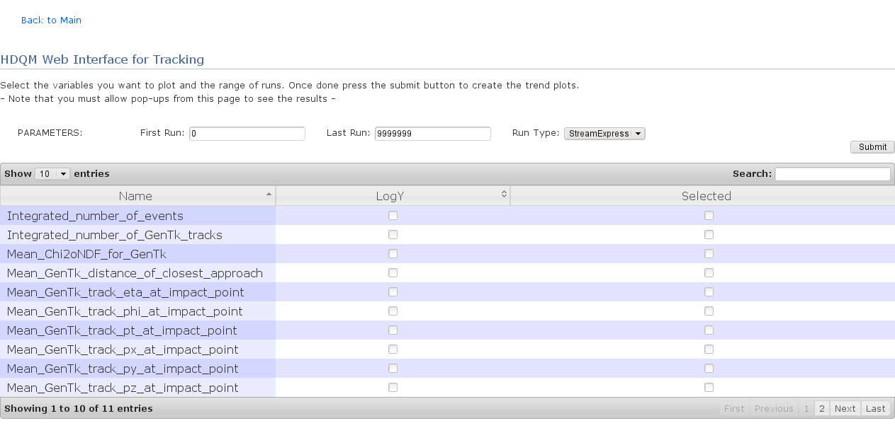
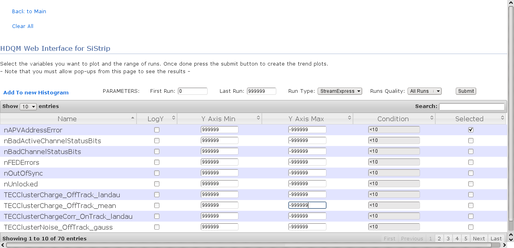

The HistoryDQM is a tool that allows to produce trend plots of DQM quantities vs run number.  
This tool can be used to monitor the status of the detector over a period of time to spot possible variations.

I developed a web application to interface to the main tool, which is available here:
<a href="http://historydqmweb.cern.ch:8080" name="historydqmweb">http://historydqmweb.cern.ch:8080</a>
(accessible only from the CERN network, people outside need to open a tunnel)

Here is a screenshot of the interface:

<h2>Improved Web Interface</h2>

During the Summer of 2010 I followed a summer student who worked on the web inteface introducing several new
features.

The new interface is avaliable here:
<a href="http://historydqmweb.cern.ch:8081"name="historydqmweb">http://historydqmweb.cern.ch:8081</a>.
It is still only accessible from the CERN network, but work in ongoing to make it accessible from
outside (with password protection) by setting up an apache server as middleware across the firewall.

Screenshot of the new interface showing the new features:

This <a href="http://indico.cern.ch/getFile.py/access?contribId=3&sessionId=3&resId=1&materialId=slides&confId=82611">presentation</a> given by the summer student gives and overview of the interface and some details on the
implementation, the current features and the plans for future developments.
